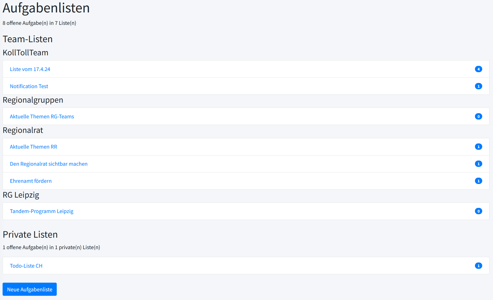
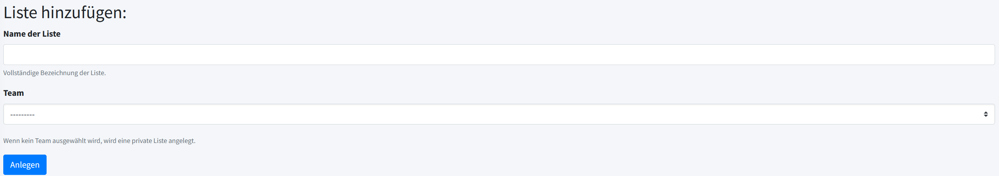
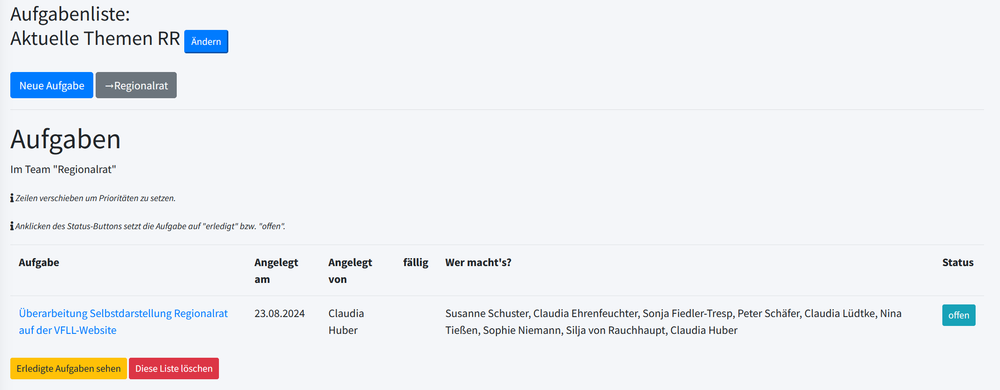
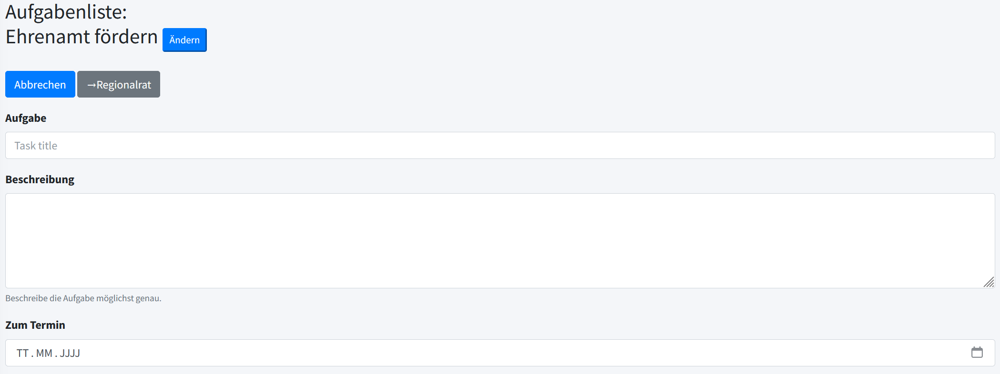
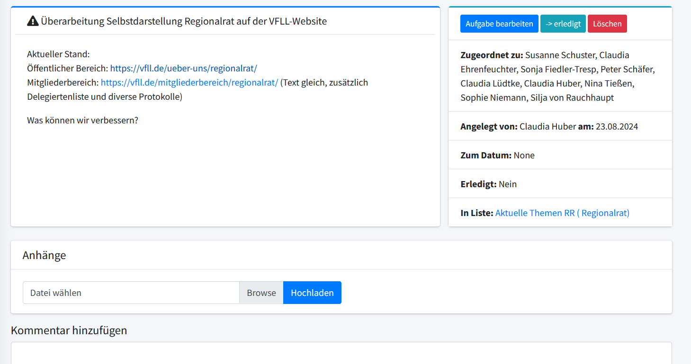
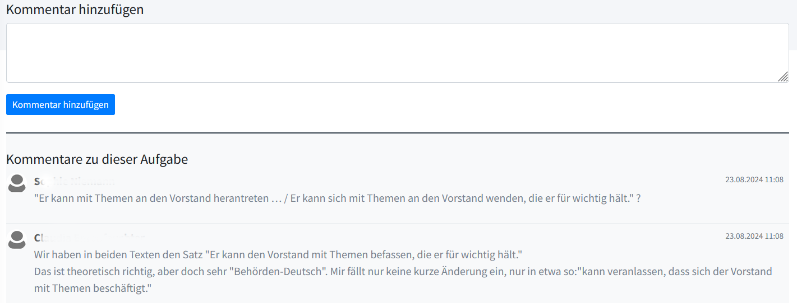

# Aufgabenlisten und Aufgaben

## Aufgabenlisten

Aufgabenlisten sind Todo-Listen, in denen die Teams zu erledigende
Aufgaben thematisch sortiert festhalten und deren Bearbeitung
dokumentieren können.

Links in der Menüleiste findet man den Menüpunkt *Aufgaben* \(→\). Ein Klick darauf öffnet eine Seite, auf der die Aufgabenlisten der eigenen Teams
angezeigt werden, sortiert nach den Teams.

Unten auf der Seite folgen die privaten Listen, sofern solche angelegt wurden.

Die Zahlen in den blauen Kreisen rechts neben den Aufgabenlisten geben
die Anzahl der in den Listen vorhandenen Aufgaben an.

### Neue Aufgabenliste anlegen

Eine neue Aufgabenliste wird über den Button *Neue Aufgabenliste* angelegt,
der sich am Ende der Seite mit den Aufgabenlisten befindet. Es öffnet
sich eine Eingabemaske mit dem Titel *Liste hinzufügen*.

Man trägt den Titel der neuen Aufgabenliste ein und wählt das Team aus,
dem die Aufgabenliste gehören soll.

Wählt man kein Team aus, erstellt man eine Aufgabenliste für sich
selbst.

Über den Button *Anlegen* wird die neue Aufgabenliste erstellt.

### Anzeigen einer vorhandenen Aufgabenliste

Ein Klick auf eine Aufgabenliste öffnet diese Liste. Angezeigt werden
zunächst die unerledigten Aufgaben.

Oben steht der Name der Aufgabenliste, darunter ein Button zum Anlegen
einer neuen Aufgabe. Der graue Button führt bei Bedarf zur
Übersichtseite des Teams, dem die Aufgabenliste gehört. Über *Ändern* lässt sich die Aufgabenliste umbenennen.

Darunter werden die Aufgaben aufgeführt, die in der Aufgabenliste
enthalten sind. Zu jeder Aufgabe finden sich folgende Informationen:

- Name der Aufgabe
- Wann angelegt
- Von wem angelegt
- Bis wann zu erledigen
- Von wem zu erledigen
- Status der Bearbeitung

Unten auf der Seite finden sich noch ein Button, über den man die
bereits erledigten Aufgaben anzeigen lassen kann, sowie einen Button, um
die Aufgabenliste zu löschen.

### Status der Aufgabe

Öffnet man eine Aufgabenliste, zeigt ein blaugrüner Button den Status
der Aufgaben an:

- *offen*: Die Aufgabe ist noch in Bearbeitung/nicht erledigt.
- *erledigt*: Die Aufgabe ist erledigt.

Ein Klick auf den Status-Button ändert den Status von *offen* zu
*erledigt* bzw. umgekehrt.

*Achtung*: Wird der Status zu *erledigt* geändert, verschwindet die
Aufgabe aus der Liste, weil hier nur die unerledigten (offenen) Aufgaben
angezeigt werden.

Um die erledigten Aufgaben anzeigen zu lassen, klickt man auf den gelben
Button *Erledigte Aufgaben sehen*. Hier lässt sich der Status einer
erledigten Aufgabe bei Bedarf wieder auf *offen* setzen.

Enthält eine Liste mehrere Aufgaben, so kann man Zeilen verschieben, um Prioritäten zu setzen.

## Aufgaben

### Neue Aufgabe anlegen

Ein Klick auf eine Aufgabenliste öffnet diese Liste. Direkt unter dem
Namen der Aufgabenliste befindet sich ein Button *Neue Aufgabe*.

Ein Klick darauf öffnet eine Eingabemaske:

Man trägt die Bezeichnung der neuen Aufgabe ein sowie ggf. eine kurze
Beschreibung und wählt den Termin, bis zu dem die Aufgabe erledigt sein
soll – entweder durch direktes Eintippen oder über das Kalendersymbol
ganz rechts. Man kann den Termin aber auch offen lassen, beispielsweise bei einer Daueraufgabe.

Im Feld *Zugeordnet zu* werden die Mitglieder des Teams aufgelistet, das
die Aufgabenliste angelegt hat, zu der die neue Aufgabe gehört. Aus
diesen wählt man diejenigen aus, die für die Erledigung der Aufgabe
zuständig sein sollen.

*Bemerkung*: Da die Aufgabenlisten teambezogen sind, lässt sich beim
Anlegen einer Aufgabe das Team nicht mehr frei wählen.

Ein Klick auf den Button *Submit* speichert die neue Aufgabe.

### Vorhandene Aufgabe bearbeiten

Klickt man in der Aufgabenliste auf eine Aufgabe, werden deren Details
angezeigt.

Der Titel der Aufgabe und ggf. eine Beschreibung stehen in dem großen Feld
links. Rechts daneben finden sich drei Buttons:

- *Aufgabe bearbeiten*: Ein Klick öffnet ein Fenster zum Bearbeiten.
- *erledigt*: Ein Klick ändert den Status der Aufgabe
- *Löschen*: Ein Klick löscht die Aufgabe.

Darunter finden sich Informationen zur Aufgabe:

- Wem ist die Aufgabe zugeordnet, d. h., wer soll sie erledigen
- Wer hat die Aufgabe wann angelegt
- Bis wann soll die Aufgabe erledigt werden
- Ist die Aufgabe erledigt
- Aufgabenliste, zu der die Aufgabe gehört

Unterhalb der eigentlichen Aufgabe findet sich ein Feld zum Auswählen
und Hochladen von Anhängen, um diese der Aufgabe zuzufügen. Es können aktuell nur PDF-Dateien hochgeladen werden.

Um die Aufgabe zu bearbeiten, klickt man auf den blauen Button oben
rechts *Aufgabe bearbeiten*. Es öffnet sich ein Fenster, in dem geändert
werden können:

- Titel der Aufgabe
- Beschreibung der Aufgabe
- Deadline der Aufgabe (entweder durch direktes Eintippen des Datums
oder über das Kalendersymbol rechts)
- die für die Bearbeitung zuständige(n) Person(en). In einer Liste
werden die Mitglieder des Teams angezeigt, das die Aufgabe angelegt hat.
Aus diesen wählt man die Betreffenden aus.

Hat man alle gewünschten Änderungen eingetragen, speichert man diese mit
dem Button *Submit* ab.

### Mit Aufgaben arbeiten

Unterhalb der Aufgabe gibt es ein Feld, in dem man einen Kommentar zur Aufgabe eintragen und mit dem Button *Kommentar hinzufügen* speichern kann.

Die bereits vorhandenen Kommentare werden darunter angezeigt mit dem
Namen des/der Kommentierenden und dem Datum.

Eigene Kommentare kann man editieren (Stiftsymbol) und löschen (Papierkorbsymbol).

Mit der Kommentarfunktion lassen sich übersichtlich Anmerkungen und Fragen zum Thema der Aufgabe sammeln. Aufgaben eignen sich daher auch gut, um Fragestellungen zu diskutieren.
