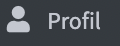

# Benutzerprofile

Jeder Benutzer hat im KollTool ein eigenes Profil (→ \), in dem er Vor- und Zuname, ein Profilbild und Angaben zu seiner Biografie hinzufügen kann.

Die Buttons zum Bearbeiten des Profils findet man rechts oben:

+ Edit
+ Passwort ändern
+ Post anlegen

Jeweils „Aktualisieren“ nicht vergessen, um die vorgenommenen Änderungen zu speichern!

*Edit*: Alle Felder sind für das KollTool *optional*, da die Useridentifizierung und Userauthentifizierung über den intern geführten *username* und die E-Mail-Adresse läuft. 

Trotzdem ist es sinnvoll, zumindest die Felder Vorname und Nachname auszufüllen bzw. (falls sie beim Anlegen des Accounts schon eingetragen wurden) sie ggf. zu korrigieren.

Hat das Team einen Nextcloud-Bereich \(siehe [[nextcloud]]\) muss zwingend der *Nextcloud key* eingetragen werden.

Standardmäßig sind die Benachrichtigungen aktiviert. Die Benachrichtigungsmails tragen *kolltool@vflll.de* als Absender. Wer nicht benachrichtigt werden möchte, muss die Funktion deaktivieren: Häkchen bei „Benachrichtigungen“ entfernen und „Aktualisieren“. Wem eine Aufgabe zugewiesen wurde, wird auch bei deaktivierter Benachrichtigungsfunktion benachrichtigt!

*Post anlegen*: Der hier eingefügte Text erscheint auf der KollTool-Startseite. Bitte von dieser Funktion nur Gebrauch machen, wenn die Information für alle KollTool-Nutzer\*innen wichtig ist!
