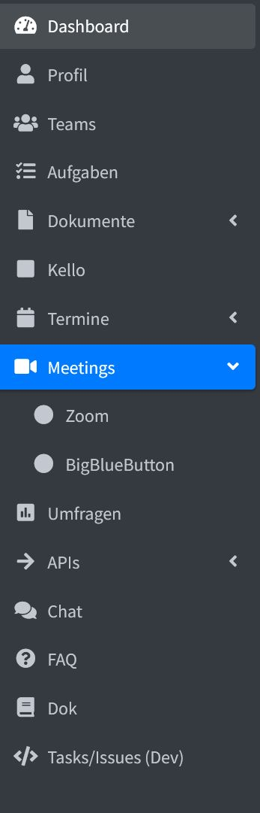
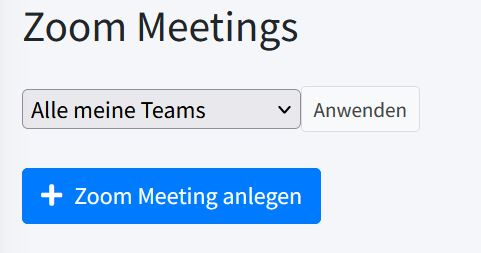
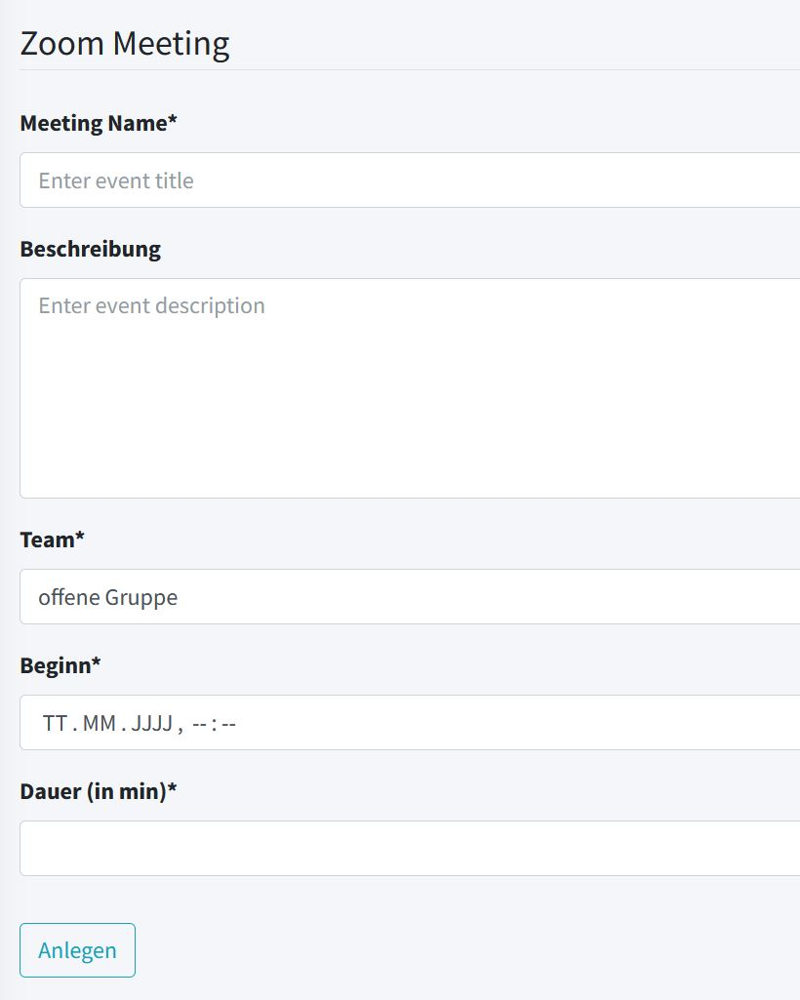

# Der Zoom-Kalender im KollTool

Zu finden ist der Zoom-Kalender unter Meetings:

Klickt man *Zoom* an, öffnet sich ein Kalender, in dem alle geplanten
Zoom-Meetings aufgelistet sind.

Links oben gibt es einen blauen Button „+ Zoom Meeting anlegen".

Klickt man diesen an, öffnet sich die Eingabemaske:

Alle Felder ausfüllen und mit „Anlegen" bestätigen.

Standardmäßig wird der Termin der offenen Gruppe zugeordnet. Es kann aber auch ein anderes Team ausgewählt werden.

Es wird automatisch geprüft, ob der Zoom-Raum zu dem geplanten
Termin noch frei ist. Falls er bereits reserviert sein sollte, erscheint
eine entsprechende Meldung.

Klickt man einen Termin im Kalender an, öffnet sich ein Fenster „Zoom
Meeting Details".

Dort gibt es oben fünf Buttons:

- „Alle Termine": führt zum Gesamtkalender, der auch die Zoom-Meetings anzeigt.
- „Zum Zoom-Kalender":  Wie der Name schon sagt, geht es damit zurück zum
Zoom-Kalender.
- „Edit": In dem sich öffnenden Fenster können Details (beispielsweise eine
Beschreibung) ergänzt oder die Daten geändert werden. „Submit" nicht
vergessen.
- Papierkorbsymbol: Termin löschen.
- Kamerasymbol Z: Damit geht es direkt zu Zoom.

## Informationen zum Zoom-Zugang

Im Verzeichnis „Offene Gruppe" findet sich das [[documents|Dokument]] „*1 Zoom-Zugang*“ mit allen erforderlichen Informationen.

